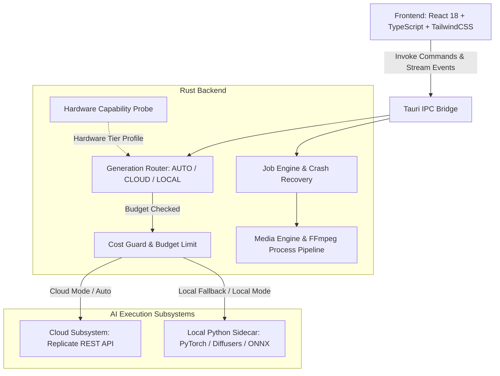

# AutoVideo AI

> Production-Grade Desktop AI Video Transformation & Generation Studio built with Tauri, Rust, React, and Hybrid AI Orchestration.

---

## 1. Product Overview

AutoVideo AI is a high-performance desktop application engineered for character replacement, style transformation, and generative video synthesis. It utilizes a **Hybrid AI Architecture**:
- **Cloud-First Fast Path**: Dispatches heavy video-to-video / image-to-video generation tasks to scalable cloud inference providers (e.g. Replicate) for high resolution and fast turnaround regardless of host GPU specs.
- **Local Neural Engine**: Local fallback using PyTorch/Diffusers (Stable Diffusion 1.5, AnimateDiff, ControlNet, IP-Adapter) and ONNX Runtime for offline processing.
- **Native Media Subsystem**: Rust-native job pipeline orchestration, frame caching, sub-second FFmpeg/FFprobe stream extraction, and audio preservation.

---

## 2. System Architecture



---

## 3. Installation & System Requirements

### Prerequisites
- **Node.js**: v18.0+ (`npm` or `pnpm`)
- **Rust Toolchain**: 1.75+ (`rustc`, `cargo`)
- **FFmpeg & FFprobe**: Must be installed and accessible in system `PATH`.
- **Operating System**: Windows 10/11, macOS, or Linux.
- **(Optional) Local ML Environment**:
  - Python 3.11
  - PyTorch with CUDA (e.g. CUDA 11.8 / 12.1)
  - Dedicated virtual environment at `.venv-generative`

### Setup Steps
```powershell
# 1. Clone repository
git clone https://github.com/quanittb/autovideo-ai.git
cd autovideo-ai

# 2. Install frontend dependencies
npm install

# 3. Build frontend bundle
npm run build

# 4. Verify Rust backend compilation
cargo check --manifest-path src-tauri/Cargo.toml --all-targets

# 5. Run test suite
cargo test --manifest-path src-tauri/Cargo.toml -- --test-threads=1
```

---

## 4. Capability Status Matrix (Repository Truth)

| Subsystem / Feature | Current Status | Description |
|---|---|---|
| **Media Cache & Stream Extraction** | `REAL_AND_VERIFIED` | Full FFmpeg probe, frame extraction, and lossless audio extraction verified on physical MP4s. |
| **Pipeline Job Engine & Recovery** | `REAL_AND_VERIFIED` | 6-stage video processing lifecycle with real cancellation, retry, and startup crash recovery. |
| **Hardware Adaptive Classification** | `REAL_AND_VERIFIED` | Live probe isolates GPU VRAM tiers and flags Turing FP16 instability (e.g. GTX 1650 4GB). |
| **Local Neural Inference (SD1.5 / AD)** | `REAL_AND_VERIFIED` | Validated end-to-end MP4 generation (`outputs/phase12/final/accepted_video.mp4`, 0 NaNs). |
| **Cloud Video Provider Abstraction** | `REAL_AND_VERIFIED` | Unified `CloudVideoProvider` trait, `GenerationRouter`, and `CostGuard` budget checks. |
| **Live Remote Cloud Generation** | `BLOCKED_BY_CREDENTIALS` | Replicate REST client implemented and verified via unit tests; live execution awaits `REPLICATE_API_TOKEN`. |
| **Legacy Wizard Step Views** | `MOCK_OR_PLACEHOLDER` | `StepTransform.tsx`, `StepExport.tsx`, `ResultView.tsx` contain prototype mock timers/emojis; superceded by `GenerativeStudioView` and `JobMonitor`. |

---

## 5. Cloud Provider Configuration

AutoVideo AI implements a strict **Zero-Fake Policy**. Missing credentials halt execution with `REAL_CLOUD_LIVE_BLOCKED` rather than generating mock artifacts or fake cost statistics.

To enable live cloud video generation:

### Windows (PowerShell)
```powershell
# Set your Replicate API Token
$env:REPLICATE_API_TOKEN = "r8_your_actual_token_here"

# Execute real acceptance test runner
& ".\.venv-generative\Scripts\python.exe" ".\src-tauri\scripts\cloud_live_acceptance.py"
```

### Linux / macOS (Bash)
```bash
export REPLICATE_API_TOKEN="r8_your_actual_token_here"
python3 src-tauri/scripts/cloud_live_acceptance.py
```

### Cost Safety Guard
The backend enforces a deterministic `max_cost_per_job` limit (default: `$5.00`). If a requested duration/resolution exceeds the budget threshold, the backend immediately rejects the job with `CLOUD_COST_LIMIT_EXCEEDED` before any remote API dispatch occurs.

---

## 6. Testing & Quality Assurance

Run all validation checks:
```powershell
# Format check
cargo fmt --manifest-path src-tauri/Cargo.toml -- --check

# Rust compilation
cargo check --manifest-path src-tauri/Cargo.toml --all-targets

# Automated test suite (612 tests)
cargo test --manifest-path src-tauri/Cargo.toml -- --test-threads=1

# Frontend production build
npm run build
```

---

## 7. License & Compliance

Developed under the AutoVideo AI Project. All external model weights, runtime dependencies, and API credentials must comply with respective provider licenses and terms of service.
