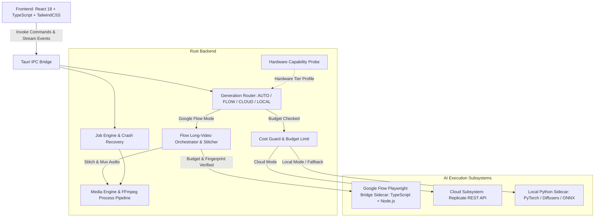

# AutoVideo AI

> Production-Grade Desktop AI Video Transformation & Generation Studio built with Tauri, Rust, React, and Hybrid AI Orchestration.

---

## 1. Product Overview

AutoVideo AI is a high-performance desktop application engineered for character replacement, style transformation, and generative video synthesis. It utilizes a **Hybrid Multi-Engine AI Architecture**:
- **Google Flow Automation Engine**: Headless/Interactive Playwright sidecar automation for Google Flow video generation (`Omni Flash`, `Veo 2`), supporting long-video multi-segment generation, contiguous frame-accurate CFR stitching, original audio preservation, zero-fake dual-ledger accounting, and crash-resilient segment resumption.
- **Cloud-First Fast Path**: Dispatches heavy video-to-video / image-to-video generation tasks to scalable cloud inference providers (e.g. Replicate) with pre-submission budget guards.
- **Local Neural Engine**: Local fallback using PyTorch/Diffusers (Stable Diffusion 1.5, AnimateDiff, ControlNet, IP-Adapter) and ONNX Runtime for offline processing.
- **Native Media Subsystem**: Rust-native job pipeline orchestration, frame caching, sub-second FFmpeg/FFprobe stream extraction, and audio preservation.

---

## 2. System Architecture



---

## 3. Google Flow Long-Video Pipeline Architecture

For videos exceeding the single-generation length (e.g. 10s), the system executes an automated multi-stage pipeline:

1. **Analysis & Ingestion**: Probes input video for frame rate, duration, and CFR consistency.
2. **Contiguous Frame-Aligned Segmentation**: Splits source video into frame-accurate segments (e.g. 10s chunks) without loss of edge frames.
3. **Pre-Click Safety & Cost Gate**: Connects to Google Flow session, verifies target profile, uploads source video, verifies exact model and duration configuration, computes pre-click fingerprint, and validates against budget limits.
4. **Segment Execution & Zero-Fake Accounting**: Submits each segment with single-click guarantees, tracks generation state semantically, and logs credit expenditures to the dual-ledger.
5. **Zero-Paid Recovery & Resumption Engine**: If generation encounters a timeout or interruption, the recovery engine correlatively locates and downloads the completed output without duplicate paid clicks. The `resume_flow_generation` IPC command allows continuation from uncompleted segments.
6. **Stitcher & Audio Preservation**: Normalizes all downloaded segment artifacts to target CFR 30fps MP4s, stitches them seamlessly into the final timeline, extracts original audio from source media, and muxes it with stream copy into the final video.
7. **Asset Library Registration**: Registers the finished video as a `DerivedMediaAsset` in the active project.

---

## 4. Installation & System Requirements

### Prerequisites
- **Node.js**: v18.0+ (`npm` or `pnpm`)
- **Rust Toolchain**: 1.75+ (`rustc`, `cargo`)
- **FFmpeg & FFprobe**: Must be installed and accessible in system `PATH`.
- **Operating System**: Windows 10/11, macOS, or Linux.
- **(Optional) Local ML Environment**:
  - Python 3.11
  - PyTorch with CUDA (e.g. CUDA 11.8 / 12.1)
  - Dedicated virtual environment at `.venv-generative`

### Setup Steps
```powershell
# 1. Clone repository
git clone https://github.com/quanittb/autovideo-ai.git
cd autovideo-ai

# 2. Install frontend dependencies
npm install

# 3. Build sidecars
cd src-tauri/sidecars/flow-playwright
npm install
npm run build
cd ../../..

# 4. Build frontend bundle
npm run build

# 5. Verify Rust backend compilation
cargo check --manifest-path src-tauri/Cargo.toml --all-targets

# 6. Run test suite
cargo test --manifest-path src-tauri/Cargo.toml -- --test-threads=1
```

---

## 5. Capability Status Matrix (Repository Truth)

| Subsystem / Feature | Current Status | Description |
|---|---|---|
| **Google Flow Long-Video Pipeline** | `REAL_AND_VERIFIED` | Full multi-segment workflow with pre-click safety gates, Playwright bridge, seamless stitching, original audio preservation, and zero-paid recovery. |
| **Flow Resumption & Error Recovery** | `REAL_AND_VERIFIED` | `resume_flow_generation` IPC command and UI Resume button with segment preservation. |
| **Zero-Fake Dual-Ledger Accounting** | `REAL_AND_VERIFIED` | Strict separation of quarantined attempts and clean rerun authorizations; zero fake balances. |
| **Media Cache & Stream Extraction** | `REAL_AND_VERIFIED` | Full FFmpeg probe, frame extraction, and lossless audio extraction verified on physical MP4s. |
| **Pipeline Job Engine & Recovery** | `REAL_AND_VERIFIED` | 6-stage video processing lifecycle with real cancellation, retry, and startup crash recovery. |
| **Hardware Adaptive Classification** | `REAL_AND_VERIFIED` | Live probe isolates GPU VRAM tiers and flags Turing FP16 instability (e.g. GTX 1650 4GB). |
| **Local Neural Inference (SD1.5 / AD)** | `REAL_AND_VERIFIED` | Validated end-to-end MP4 generation (`outputs/phase12/final/accepted_video.mp4`, 0 NaNs). |
| **Cloud Video Provider Abstraction** | `REAL_AND_VERIFIED` | Unified `CloudVideoProvider` trait, `GenerationRouter`, and `CostGuard` budget checks. |

---

## 6. Testing & Quality Assurance

Run all validation checks:
```powershell
# Format check
cargo fmt --manifest-path src-tauri/Cargo.toml -- --check

# Rust compilation
cargo check --manifest-path src-tauri/Cargo.toml --all-targets

# Automated backend test suite
cargo test --manifest-path src-tauri/Cargo.toml -- --test-threads=1

# Frontend unit & store test suite
npx vitest run

# Frontend production build
npm run build
```

---

## 7. License & Compliance

Developed under the AutoVideo AI Project. All external model weights, runtime dependencies, and API credentials must comply with respective provider licenses and terms of service.
