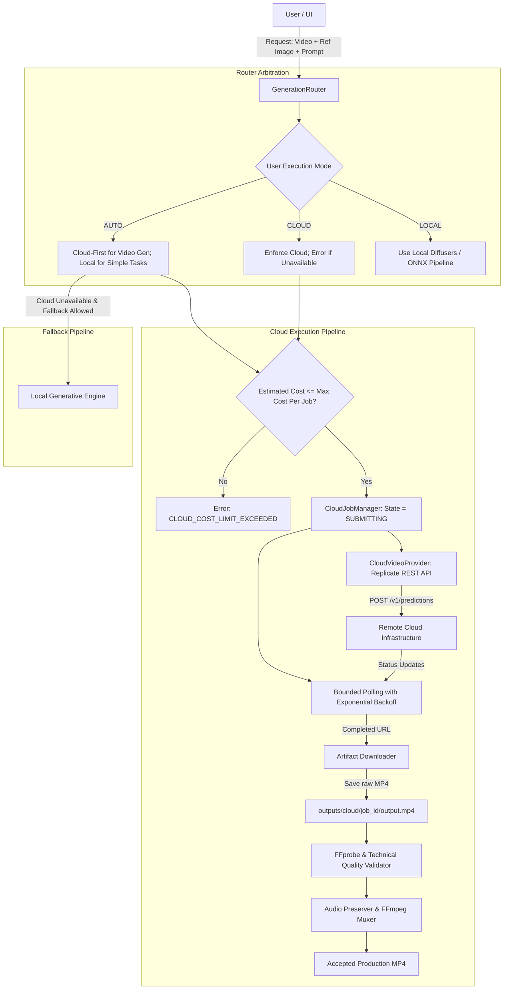

# AutoVideo AI — Cloud MVP Architecture

## 1. System Context & Overview

AutoVideo AI is a hybrid desktop video transformation platform built with **Rust + Tauri** and **TypeScript / React**.

Prior phases established:
- Dynamic 6-tier hardware capability classification (`CPU_ONLY`, `ULTRA_LOW_VRAM`, `LOW_VRAM`, `BALANCED`, `HIGH`, `VERY_HIGH`).
- Empirical precision probing (FP32 pinned on Turing TU116/TU117 GTX 1650 GPUs).
- Multi-conditioning local pipeline (SD1.5, AnimateDiff v3, OpenPose, Depth, IP-Adapter Face Plus).
- Lossless audio preservation and FFmpeg multiplexing.
- Provenance tracking with zero-fake enforcement.

Phase Cloud MVP introduces a **Cloud-First Video Generation Subsystem**, allowing high-quality, high-speed neural video generation without relying on local GPU hardware constraints, while maintaining local processing for media analysis, control extraction, audio handling, and final container muxing.



## 2. Provider Abstraction

The Cloud Subsystem is organized around decoupled Rust traits in `src-tauri/src/ai/cloud/`:

```rust
pub trait CloudVideoProvider: Send + Sync {
    fn provider_id(&self) -> &str;
    fn provider_name(&self) -> &str;
    fn capabilities(&self) -> ProviderCapabilities;
    fn estimate_cost(&self, request: &CloudGenerationRequest) -> CostEstimate;
    async fn submit_job(&self, request: &CloudGenerationRequest) -> Result<CloudJobHandle, CloudProviderError>;
    async fn poll_status(&self, job_id: &str) -> Result<CloudJobStatus, CloudProviderError>;
    async fn cancel_job(&self, job_id: &str) -> Result<(), CloudProviderError>;
    async fn download_result(&self, output_url: &str, target_path: &Path) -> Result<PathBuf, CloudProviderError>;
}
```

## 3. Data Flow

1. **Input Submission**: UI submits `source_video`, optional `reference_image`, `prompt`, `task_type` (`CharacterReplacement`, `StyleTransformation`, `FullTransformation`), and user execution mode (`AUTO`, `CLOUD`, `LOCAL`).
2. **Pre-flight & Cost Guard**: Router calculates `estimated_cost`. If `estimated_cost > max_cost_per_job`, execution halts with `CLOUD_COST_LIMIT_EXCEEDED`.
3. **Dispatch**: Rust backend invokes the authenticated REST endpoint (e.g. Replicate `POST /v1/predictions`).
4. **State Machine**: Job transitions through `QUEUED` $\rightarrow$ `SUBMITTING` $\rightarrow$ `PROCESSING` $\rightarrow$ `DOWNLOADING` $\rightarrow$ `VALIDATING` $\rightarrow$ `COMPLETED`.
5. **Download & Validation**: Remote MP4 is downloaded to `outputs/cloud/<job_id>/raw_video.mp4` and verified using FFprobe (stream existence, non-zero duration, valid H.264 video stream).
6. **Audio Preservation**: Source audio is extracted and muxed into the final container.
7. **Metadata & Telemetry**: Full latency timestamps ($T_0$ to $T_5$) and costs are recorded in `metadata.json`.

## 4. Error Taxonomy

Machine-readable error codes prevent ambiguous failures:
- `CLOUD_PROVIDER_UNAVAILABLE`: Provider endpoint unreachable or unconfigured.
- `CLOUD_AUTH_FAILED`: Missing or invalid API credentials (e.g. `REPLICATE_API_TOKEN` missing).
- `CLOUD_REQUEST_INVALID`: Malformed payload, unsupported resolution or model parameters.
- `CLOUD_RATE_LIMITED`: HTTP 429 quota or rate limit exceeded.
- `CLOUD_TIMEOUT`: Polling exceeded configured `cloud.job_timeout_seconds`.
- `CLOUD_JOB_FAILED`: Remote worker reported execution error.
- `CLOUD_DOWNLOAD_FAILED`: Network error while downloading remote artifact.
- `CLOUD_OUTPUT_INVALID`: Downloaded file is corrupted or failed FFprobe container validation.
- `CLOUD_COST_LIMIT_EXCEEDED`: Estimated cost exceeds configured limit.
- `CLOUD_NETWORK_ERROR`: Transient HTTP connection error.
