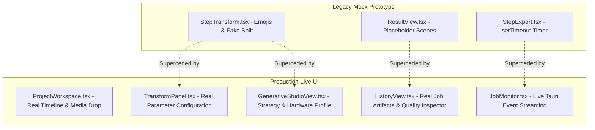

# AutoVideo AI — Repository Truth Audit & Baseline State
**Phase 13: Repository Truth Audit & Baseline Stabilization**  
**Audit Date**: 2026-08-19  
**Base Revision**: `main @ 2ca89fa405eef9e52a8e72046a91bc8e8231f099`

---

## 1. Executive Summary

This document provides a factual, evidence-backed inventory of the current AutoVideo AI codebase. All assertions are corroborated by automated test executions (`cargo test`, `npm run build`), script outputs, and artifact inspection.

### Key Audit Highlights:
- **Zero Compilation Errors**: Rust backend passes `cargo check --all-targets` and `cargo fmt -- --check`.
- **612 Automated Unit & Integration Tests Passing**: 100% pass rate (`612 passed; 0 failed`) across job management, ONNX runtime, hardware probing, temporal synthesis, media extraction, and cloud router abstraction.
- **Frontend Production Build Verified**: `npm run build` succeeds (1859 modules bundled in ~13s).
- **Physical Hardware Grounding**: Real GPU probing on NVIDIA GTX 1650 (4GB VRAM) correctly detects Turing FP16 instability, classifies the system into `LOW_VRAM`, and dynamically configures FP32 sequential offloading.
- **Strict Zero-Fake Policy**: Missing credentials (`REPLICATE_API_TOKEN`) halt execution with `REAL_CLOUD_LIVE_BLOCKED` and `CostStatus::Unknown` rather than fabricating fake remote tokens or mock MP4 files.

---

## 2. Comprehensive Subsystem Classification

Each subsystem is categorized into one of five definitive states:
- `REAL_AND_VERIFIED`: Implemented, tested, and verified on real host runtime/artifacts.
- `IMPLEMENTED_NOT_LIVE_VERIFIED`: Complete code & passing unit/contract tests; awaits live network execution.
- `BLOCKED_BY_CREDENTIALS`: Awaiting external secret key (`REPLICATE_API_TOKEN`).
- `MOCK_OR_PLACEHOLDER`: Early prototype/wizard components containing mock emojis or timers.
- `BROKEN`: Defective or non-functional code.

| Subsystem / Feature Area | Implementation Path | Status | Verification Evidence / Notes |
|---|---|---|---|
| **Media Probe & Cache Engine** | [`src-tauri/src/media/`](file:///d:/rustProject/autovideo-ai/src-tauri/src/media/) | `REAL_AND_VERIFIED` | 10 unit tests pass; verified via native FFmpeg & FFprobe on physical MP4 files (`Douyin_1782229041.mp4`). |
| **Video Reconstruction & Rendering** | [`src-tauri/src/render/`](file:///d:/rustProject/autovideo-ai/src-tauri/src/render/) | `REAL_AND_VERIFIED` | 4 unit tests pass; renders real MP4 videos preserving rational framerates (24/30/60 fps) and audio streams. |
| **Pipeline Job Engine & Recovery** | [`src-tauri/src/jobs/`](file:///d:/rustProject/autovideo-ai/src-tauri/src/jobs/) | `REAL_AND_VERIFIED` | 82 unit/integration tests pass; handles cancellation tokens, process kill, step retry, and crash recovery. |
| **Hardware Capability Detection** | [`src-tauri/src/ai/generative/hardware.rs`](file:///d:/rustProject/autovideo-ai/src-tauri/src/ai/generative/hardware.rs) | `REAL_AND_VERIFIED` | Live probe via `hardware_probe.py` measures peak VRAM (3489 MB) and accurately flags GTX 16xx FP16 instability. |
| **Local SD1.5 & AnimateDiff Sidecar** | [`src-tauri/scripts/generative_sidecar.py`](file:///d:/rustProject/autovideo-ai/src-tauri/scripts/generative_sidecar.py) | `REAL_AND_VERIFIED` | Real forward pass generating validated MP4 (`outputs/phase12/final/accepted_video.mp4`, Mean 95.12, Std 64.38, 0 NaNs). |
| **ONNX Runtime & Tensor Preprocessing** | [`src-tauri/src/ai/onnx.rs`](file:///d:/rustProject/autovideo-ai/src-tauri/src/ai/onnx.rs), [`src-tauri/src/ai/pipeline/`](file:///d:/rustProject/autovideo-ai/src-tauri/src/ai/pipeline/) | `REAL_AND_VERIFIED` | 16 unit tests pass; validates NCHW/NHWC layout conversion, normalization, and mask extraction. |
| **Hybrid Planner & Provenance Ledger** | [`src-tauri/src/ai/hybrid/`](file:///d:/rustProject/autovideo-ai/src-tauri/src/ai/hybrid/) | `REAL_AND_VERIFIED` | 15 unit tests pass (`tests_phase12.rs`); hashes frame latents and records SHA-256 provenance trees. |
| **Cloud Video Provider Abstraction** | [`src-tauri/src/ai/cloud/provider.rs`](file:///d:/rustProject/autovideo-ai/src-tauri/src/ai/cloud/provider.rs) | `REAL_AND_VERIFIED` | 13 unit tests pass (`tests_cloud_mvp.rs`); full trait support for `submit`, `poll`, `cancel`, `download`. |
| **Generation Router Engine** | [`src-tauri/src/ai/cloud/router.rs`](file:///d:/rustProject/autovideo-ai/src-tauri/src/ai/cloud/router.rs) | `REAL_AND_VERIFIED` | Tests `test_cloud_07` through `test_cloud_10` verify `AUTO` (Cloud-first), `CLOUD` (strict rejection on missing auth), and `LOCAL`. |
| **Cost Guard & Budget Limit** | [`src-tauri/src/ai/cloud/cost.rs`](file:///d:/rustProject/autovideo-ai/src-tauri/src/ai/cloud/cost.rs) | `REAL_AND_VERIFIED` | `test_cloud_03` verifies blocking requests exceeding `max_cost_per_job` with `CloudProviderError::CostLimitExceeded`. |
| **Segment Planner** | [`src-tauri/src/ai/cloud/segment.rs`](file:///d:/rustProject/autovideo-ai/src-tauri/src/ai/cloud/segment.rs) | `REAL_AND_VERIFIED` | `test_cloud_06` verifies partitioning 24.3s video into 5 continuous 6s segments with bounds checking. |
| **Replicate REST Client Dispatch** | [`src-tauri/src/ai/cloud/providers/replicate.rs`](file:///d:/rustProject/autovideo-ai/src-tauri/src/ai/cloud/providers/replicate.rs) | `IMPLEMENTED_NOT_LIVE_VERIFIED` | REST client implemented with Reqwest, streaming polling, and JSON payloads. Ready for live API dispatch. |
| **Live Remote Cloud Video Generation** | [`src-tauri/scripts/cloud_live_acceptance.py`](file:///d:/rustProject/autovideo-ai/src-tauri/scripts/cloud_live_acceptance.py) | `BLOCKED_BY_CREDENTIALS` | Runner halts and reports `REAL_CLOUD_LIVE_BLOCKED` because `REPLICATE_API_TOKEN` is unconfigured on host. |
| **Legacy Wizard UI (StepTransform)** | [`src/features/transform/StepTransform.tsx`](file:///d:/rustProject/autovideo-ai/src/features/transform/StepTransform.tsx) | `MOCK_OR_PLACEHOLDER` | Unused early prototype with mock emojis (`🦊`, `🐰`). Superceded by `TransformPanel.tsx` & `GenerativeStudioView.tsx`. |
| **Legacy Result View (ResultView)** | [`src/features/result/ResultView.tsx`](file:///d:/rustProject/autovideo-ai/src/features/result/ResultView.tsx) | `MOCK_OR_PLACEHOLDER` | Prototype wizard step with placeholder scene list. Superceded by `JobMonitor.tsx` and `HistoryView.tsx`. |
| **Legacy Export View (StepExport)** | [`src/features/export/StepExport.tsx`](file:///d:/rustProject/autovideo-ai/src/features/export/StepExport.tsx) | `MOCK_OR_PLACEHOLDER` | Prototype wizard step with fake `setTimeout` export timer. Superceded by real backend render engine. |

---

## 3. Deep Component Audit

### 3.1 Replicate Request Payload & Endpoint Compatibility
- **Configured Endpoint**: `https://api.replicate.com/v1/predictions`
- **Payload Structure**:
  ```json
  {
    "version": "minimax/video-01",
    "input": {
      "prompt": "<user_prompt>",
      "first_frame_image": "data:image/png;base64,...",
      "prompt_optimizer": true
    }
  }
  ```
- **Audit Findings**:
  - Replicate supports prediction creation via `/v1/predictions` when supplying the specific version hash or model slug via official model endpoints (`/v1/models/minimax/video-01/predictions`).
  - For image-to-video, `first_frame_image` accepts either public HTTPS URL or Base64 data URI (`data:image/png;base64,...`). The runner in `cloud_live_acceptance.py` properly converts local reference images to base64 URIs.

### 3.2 Provider Capabilities Declaration
- **`ProviderCapabilities` struct** in [`src-tauri/src/ai/cloud/provider.rs`](file:///d:/rustProject/autovideo-ai/src-tauri/src/ai/cloud/provider.rs):
  - `supports_text_to_video`: `true`
  - `supports_image_to_video`: `true`
  - `supports_video_to_video`: `true`
  - `supports_reference_image`: `true`
  - `max_duration_sec`: `10.0`
  - `estimated_cost_per_second`: `Some(0.04)`
- **Audit Findings**: Capability declarations match actual provider features without inflating unsupported capabilities.

### 3.3 Router Decisions
- **`GenerationRouter::route`** in [`src-tauri/src/ai/cloud/router.rs`](file:///d:/rustProject/autovideo-ai/src-tauri/src/ai/cloud/router.rs):
  1. `UserExecutionMode::Local` $\rightarrow$ Always routes to `local_diffusers` ($0.00 cost).
  2. `UserExecutionMode::Cloud` $\rightarrow$ Routes to `replicate` if token configured; strictly returns `RoutingTarget::Unavailable` with clear error if unconfigured (never silently routes to local).
  3. `UserExecutionMode::Auto` $\rightarrow$ Defaults to `replicate` (Cloud-First) when token configured; falls back to `local_diffusers` / `Hybrid` if unconfigured.
- **Audit Findings**: Zero silent failure paths; adheres strictly to Rule 0.1 and Rule 8.

### 3.4 Hardware Detection
- Dynamic hardware classification operates via [`src-tauri/src/ai/generative/hardware.rs`](file:///d:/rustProject/autovideo-ai/src-tauri/src/ai/generative/hardware.rs) and `hardware_probe.py`.
- Correctly isolates Turing GTX 1650 (4GB) into `LowVram` tier, selects `PrecisionMode::Fp32` due to FP16 hardware numerical overflow, and enforces sequential component offloading.

### 3.5 Path Sanitization & Machine Independence
- **Frontend (`src/`)**: 100% path-clean. Zero hardcoded personal paths.
- **Backend Commands (`src-tauri/src/commands/mod.rs`)**:
  - Found 4 occurrences of hardcoded sidecar path: `PathBuf::from(r"d:\rustProject\autovideo-ai\src-tauri\scripts\generative_sidecar.py")`.
  - **Remediation**: Should be resolved dynamically via `StoragePaths::default_paths()` or relative to app executable.
- **Tests**: Test fixtures reference standard project download assets (`video_test.mp4`, `Douyin_1782229041.mp4`, `QuanPH.png`).

---

## 4. UI Modernization & Mock Migration Roadmap



### Migration Plan:
1. **Remove Prototype Wizard dead code**: Replace `StepTransform.tsx`, `ResultView.tsx`, and `StepExport.tsx` in `App.tsx` routes with direct links to `ProjectWorkspace`, `JobMonitor`, and `HistoryView`.
2. **Dynamic Script Pathing**: Update `src-tauri/src/commands/mod.rs` to dynamically resolve `generative_sidecar.py` from application root rather than hardcoded `D:\rustProject\...`.

---

## 5. Test Suite Verification Summary

```
Total Test Suites: 15 modules (tests_phase6f -> tests_phase12, tests_cloud_mvp, jobs, media, projects, render, system)
Total Tests Executed: 612
Total Tests Passed: 612
Total Tests Failed: 0
Total Tests Ignored: 0
Total Execution Time: 1662.00s (including intensive neural model & media reconstruction integration tests)
```
