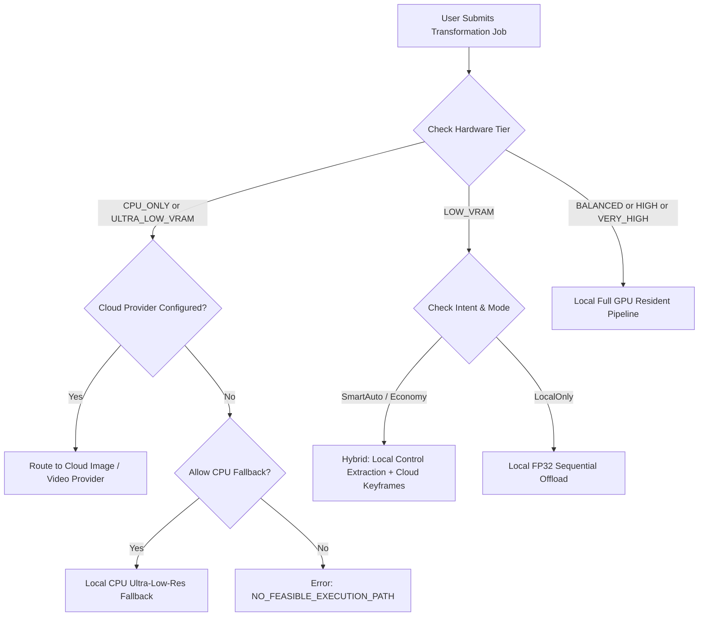

# AutoVideo AI — Hardware Capability & Adaptive Routing

## 1. Dynamic Hardware Classification Tiers

AutoVideo AI dynamically inspects available GPU hardware on launch. The system **never assumes** a specific GPU model and assigns one of 6 capability tiers:

| Capability Tier | VRAM Range | Precision Mode | UNet Strategy | VAE Strategy | Window Size / Overlap | Target Resolution |
|---|---|---|---|---|---|---|
| `CPU_ONLY` | 0 MB (No GPU) | FP32 | CPU Execution | CPU Sequential | 4 frames (stride 2) | 288x512 |
| `ULTRA_LOW_VRAM` | < 3500 MB | FP32 | CPU Offload + Sliced Attention | Sequential Frame-by-Frame | 4 frames (overlap 2) | 288x512 |
| `LOW_VRAM` | 3500 – 6000 MB | FP32 / FP16 | Sequential Layer Offload | Sequential Frame-by-Frame | 8–16 frames (overlap 4) | 512x768 / 576x1024 |
| `BALANCED` | 6000 – 10000 MB | FP16 | Model Offload | Batched (4 frames) | 16 frames (overlap 4) | 576x1024 |
| `HIGH` | 10000 – 16000 MB | FP16 / BF16 | Full GPU Resident | Full Tensor Decode | 24–32 frames (overlap 6) | 720x1280 |
| `VERY_HIGH` | > 16000 MB | BF16 / FP16 | Full GPU Resident (xFormers) | Full Tensor Decode | 32–64 frames (overlap 8) | 1080x1920 |

## 2. Empirical Precision Detection

- **Turing TU116/TU117 GPUs (GTX 1650/1660)**: These cards lack native FP16 Tensor Cores and can produce IEEE 754 NaN overflows in diffusers attention layers. The empirical probe detects this at startup and automatically pins precision to **FP32** with sequential VAE decoding.
- **Ampere / Ada / Hopper GPUs (RTX 3060+, RTX 4090)**: Use FP16 / BF16 with FlashAttention / xFormers enabled.

## 3. Router Arbitration Logic

