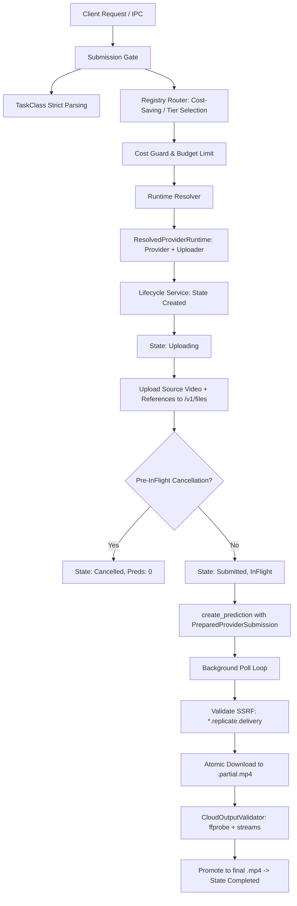

# Phase 16 — Character Replacement Provider Integration Report

**Target Model Candidate**: `prunaai/p-video-replace` (Replicate official candidate)  
**Implementation Base Revision**: `11e536babef4a0d5fb21a8de1b9472f22a513012`  
**Paid / Live Costs Incurred in Phase 16**: **$0.00** (Zero paid/live inference calls executed)

---

## 1. Summary of Changes

Phase 16 integrates the first production-ready cloud provider adapter for the `CharacterReplacement` task class, specifically designed for the Replicate model `prunaai/p-video-replace`.

Key architectural deliveries:
1. **Live Execution Policy Guard**:
   - `LiveExecutionPolicy` trait with `EnvLiveExecutionPolicy` and `MockLiveExecutionPolicy`.
   - Default safety policy enforces `ALLOW_PAID_LIVE_TEST=0`, blocking all unapproved paid network calls with `PAID_LIVE_TEST_DISABLED` while allowing local recovery, polling, and offline test mocking.
2. **Provider Asset Uploader Abstraction**:
   - Decoupled `ProviderAssetUploader` trait with `ReplicateAssetUploader` (`POST https://api.replicate.com/v1/files` multipart) and `MockAssetUploader`.
   - Clear state separation: local input paths are uploaded to remote URIs during an explicit `Uploading` lifecycle state before predictions are created.
3. **Decoupled Router & Provider Keying**:
   - `route_with_registry` operates strictly on metadata and capabilities without provider instantiation or credential reading.
   - Provider registry records are indexed by compound `ProviderKey { provider_id, model_id }`.
   - Deterministic model selection sorts candidates by `(cost, provider_id, model_id)` to ensure order-independent routing.
4. **Prepared Provider Submission Spec**:
   - Strongly typed `ProviderSubmissionSpec` constructed from validated project preservation policies, strict resolution tiers (`P720`, `P1080`), target framerates (`Original`, `Fps24`, `Fps48`), and `disable_safety_checker = false`.
   - `PreparedProviderSubmission` feeds remote URIs (`https://replicate.delivery/...`) into `create_prediction(&self, prepared: &PreparedProviderSubmission)`.
5. **SSRF Validation Hardening**:
   - Output download URIs are strictly validated against `https://replicate.delivery` and subdomains `*.replicate.delivery`.
   - Host `api.replicate.com`, root `replicate.com`, localhost, private IP spaces, and HTTP schemes are rejected.
6. **Persistence & Lifecycle Integration**:
   - Upload failures transition to `Failed` / `SubmissionState::NeverAttempted`, avoiding ambiguous submission states.
   - Crash during `Uploading` safely resets to `Created` / `NeverAttempted` on restart.
   - Crash during `ValidatingOutput` promotes verified local artifacts without duplicate downloads or submissions.
7. **IPC & Frontend Contract**:
   - TypeScript contract updated in `src/lib/ipc.ts` with `referenceImages?: string[]`.

---

## 2. Architecture Diagram

---

## 3. Files Modified and Created

### Backend Rust Implementations & Adapters
- `src-tauri/src/ai/cloud/live_execution_guard.rs` [NEW]: Live execution guard and environment toggle policies.
- `src-tauri/src/ai/cloud/uploader.rs` [NEW]: `ProviderAssetUploader` trait, `ReplicateAssetUploader`, `MockAssetUploader`.
- `src-tauri/src/ai/cloud/spec.rs` [NEW]: `ProviderSubmissionSpec` & `PreparedProviderSubmission`.
- `src-tauri/src/ai/cloud/providers/replicate_pruna.rs` [NEW]: `PrunaPVideoReplaceProvider` adapter.
- `src-tauri/src/ai/cloud/provider.rs` [MODIFIED]: `ProviderKey`, `ResolutionTier`, `TargetFps`, `create_prediction`.
- `src-tauri/src/ai/cloud/registry.rs` [MODIFIED]: Compound key indexing, `PricingTier`, `prunaai/p-video-replace` tiers.
- `src-tauri/src/ai/cloud/router.rs` [MODIFIED]: Decoupled instance-independent routing.
- `src-tauri/src/ai/cloud/submission.rs` [MODIFIED]: Decoupled submission gate validation.
- `src-tauri/src/ai/cloud/resolver.rs` [MODIFIED]: `ResolvedProviderRuntime` resolution.
- `src-tauri/src/ai/cloud/job.rs` [MODIFIED]: Backward-compatible `InputAssets`, `CloudJobRequest` multi-reference support.
- `src-tauri/src/ai/cloud/lifecycle.rs` [MODIFIED]: Upload phase separation, cancel check before in-flight, crash recovery, ID resolution.
- `src-tauri/src/ai/cloud/error.rs` [MODIFIED]: Added `SecurityViolation` and `ProtocolViolation`.
- `src-tauri/src/ai/cloud/cost.rs` [MODIFIED]: Added `resolution_tier`, `unit_rate_usd`, `pricing_observed_at`.
- `src-tauri/src/commands/mod.rs` [MODIFIED]: Updated IPC commands.

### Frontend IPC Contracts
- `src/lib/ipc.ts` [MODIFIED]: Added `referenceImages?: string[]`.

### Test Suites & Benchmarks
- `src-tauri/src/ai/tests_phase16.rs` [NEW]: 33 comprehensive unit, integration, SSRF, lifecycle, and recovery tests.
- `docs/phase_16_character_replacement_benchmark.md` [NEW]: Benchmark protocol specification for character replacement models.

---

## 4. Test Verification Results

### 4.1 Phase 16 Dedicated Suite
Command: `cargo test --manifest-path src-tauri/Cargo.toml -- test_phase16 --test-threads=1`
Result: **33 passed; 0 failed; 0 ignored**
- `test_phase16_01_paid_live_disabled_by_default`: PASSED
- `test_phase16_02_new_request_when_live_disabled_fails_safe_without_upload_or_prediction`: PASSED
- `test_phase16_03_existing_job_recovery_poll_cancel_download_works_when_live_guard_disabled`: PASSED
- `test_phase16_04_provider_key_equality_and_hashing`: PASSED
- `test_phase16_05_registry_records_unique_by_compound_key`: PASSED
- `test_phase16_06_registry_deterministic_selection_order_independent`: PASSED
- `test_phase16_07_pruna_estimate_cost_model_aware_never_uses_minimax`: PASSED
- `test_phase16_08_route_with_registry_without_provider_instance`: PASSED
- `test_phase16_09_strict_task_class_parsing_rejects_unknown`: PASSED
- `test_phase16_10_character_replacement_resolution_and_fps_routing`: PASSED
- `test_phase16_11_action_regeneration_unsupported_isolated`: PASSED
- `test_phase16_12_reference_images_normalization_and_conflict_rejection`: PASSED
- `test_phase16_13_save_audio_derived_from_project_policy`: PASSED
- `test_phase16_14_prepared_provider_submission_uses_uploaded_uris_never_local_paths`: PASSED
- `test_phase16_15_replicate_pruna_serializer_consumes_spec_not_raw_request`: PASSED
- `test_phase16_16_replicate_uploader_requires_token_and_valid_file`: PASSED
- `test_phase16_17_mock_uploader_tracks_calls_and_returns_valid_delivery_uris`: PASSED
- `test_phase16_18_upload_failure_never_becomes_ambiguous_submission`: PASSED
- `test_phase16_20_prediction_create_failure_transitions_to_ambiguous_and_blocked`: PASSED
- `test_phase16_21_ssrf_allows_replicate_delivery_and_subdomains`: PASSED
- `test_phase16_22_ssrf_rejects_replicate_com_and_third_parties`: PASSED
- `test_phase16_23_ssrf_rejects_localhost_private_ips_and_redirects`: PASSED
- `test_phase16_24_validating_output_recovery_promotes_existing_final_artifact_with_zero_submits_and_downloads`: PASSED
- `test_phase16_25_uploading_state_on_restart_resets_safely_never_ambiguous`: PASSED
- `test_phase16_26_legacy_singular_input_assets_manifest_deserialization`: PASSED
- `test_phase16_27_actual_cost_remains_none_unless_monetary_amount_present`: PASSED
- `test_phase16_28_full_mocked_character_replacement_lifecycle_with_phase16_fixture`: PASSED
- `test_phase16_30_ipc_contract_reference_images_camel_case`: PASSED
- `test_phase16_31_multiple_reference_images_up_to_3_supported`: PASSED
- `test_phase16_32_more_than_3_reference_images_rejected`: PASSED
- `test_phase16_33_zero_reference_images_rejected_for_character_replacement`: PASSED
- `test_phase16_34_disable_safety_checker_always_false_in_spec`: PASSED
- `test_phase16_35_router_model_selection_pruna_chosen_over_minimax_for_character_replacement`: PASSED

### 4.2 Phase 15 Regression Suite
Command: `cargo test --manifest-path src-tauri/Cargo.toml -- test_phase15 --test-threads=1`
Result: **38 passed; 0 failed; 0 ignored**

### 4.3 General Cloud Tests
Command: `cargo test --manifest-path src-tauri/Cargo.toml -- test_cloud --test-threads=1`
Result: **6 passed; 0 failed; 0 ignored**

### 4.4 Static & Lint Verifications
- `cargo fmt --manifest-path src-tauri/Cargo.toml -- --check`: PASSED (0 formatting issues)
- `cargo check --all-targets --manifest-path src-tauri/Cargo.toml`: PASSED (0 errors, 0 warnings)
- `npm.cmd run build`: PASSED (Built TypeScript client successfully in 17.4s)
- `ffprobe src-tauri/target/phase16_test_artifact.mp4`: PASSED (Valid H.264 720x1280 @ 24fps + AAC audio)

---

## 5. Cost Incurred in Phase 16

| Item | Calls | Cost USD |
|---|---|---|
| Replicate Files Uploads (Live) | 0 | $0.00 |
| Replicate Predictions (Live) | 0 | $0.00 |
| **Total Incurred in Phase 16** | **0** | **$0.00** |

---

## 6. Remaining Constraints & Next Steps

1. **Live Quality & Benchmark Acceptance**:
   - Real inference quality testing on `video_test.mp4` is deferred to the dedicated Live Testing Phase when explicit live execution permissions (`ALLOW_PAID_LIVE_TEST=1`) are granted.
2. **Phase Completion**:
   - Phase 16 scope is completely fulfilled and verified. Execution stops here according to Rule 12.
