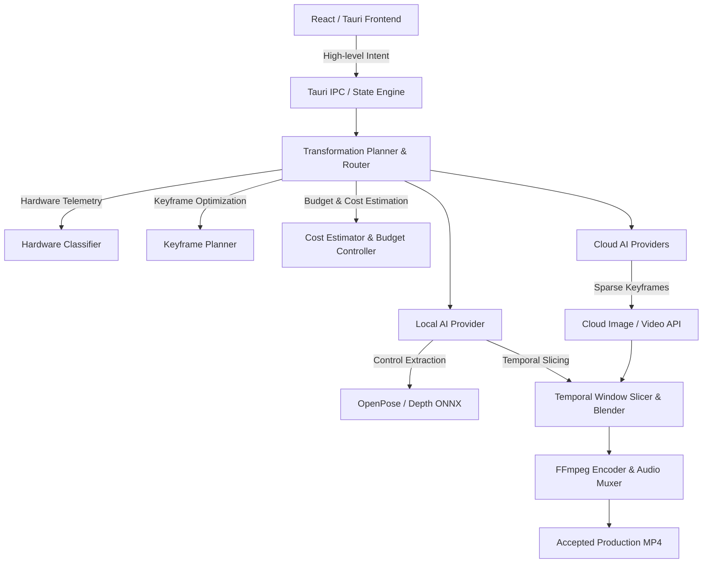

# AutoVideo AI — Production Architecture

## 1. System Overview

AutoVideo AI is a production-grade desktop application built on **Rust + Tauri** with a **TypeScript / React** frontend, communicating with an adaptive generative AI pipeline.

The architecture decouples UI workflows from low-level execution engines through a **Hybrid AI Provider Engine**, dynamically arbitrating between **Local Execution (NVIDIA / CPU)** and **Cloud Generation (Replicate / Cloud Video / Cloud Image)** based on real hardware telemetry, task intent, quality preset, and user-defined budget.

## 2. High-Level AI Transformation Pipeline

The end-to-end transformation follows a zero-fake, component-decomposed lifecycle:

1. **Media Ingestion & Validation**: Probing video container, framerate, stream count, and audio tracks via FFprobe.
2. **Dynamic Hardware Classification**: Probing GPU VRAM, compute capability, precision stability (FP16 vs FP32), and assigning runtime tier (`CPU_ONLY`, `ULTRA_LOW_VRAM`, `LOW_VRAM`, `BALANCED`, `HIGH`, `VERY_HIGH`).
3. **Component Decomposition**:
   - `Character Replacement`: Character $\rightarrow$ Cloud / Local; Background, Motion, Audio $\rightarrow$ `ReuseOriginal`.
   - `Background Replacement`: Background $\rightarrow$ Cloud / Local; Character, Motion, Audio $\rightarrow$ `ReuseOriginal`.
   - `Audio Replacement`: Audio $\rightarrow$ Local; Visuals $\rightarrow$ `ReuseOriginal`.
   - `Full Video Regeneration`: All visual components processed with temporal consistency.
4. **Keyframe-Based Sparse Generation**:
   - Instead of sending 1,800 frames to cloud for a 60-second video (unacceptable production economics), the **Keyframe Planner** selects anchor frames at scene cuts, motion peaks, and periodic strides (e.g. 48–75 keyframes).
   - Local temporal blending interpolates and stabilizes intermediate frames with cosine-weighted crossfading.
5. **Cost Estimation & Budget Control**:
   - Zero-Fake policy: if provider pricing is unknown, cost status is reported strictly as `UNKNOWN`. Never fabricate price estimates.
   - If estimated cost exceeds user threshold, execution requires explicit user confirmation (`CLOUD_COST_CONFIRMATION_REQUIRED`).
6. **Audio Preservation & FFmpeg Multiplexing**:
   - Source audio stream is extracted losslessly and re-multiplexed into the final H.264 container with exact PTS alignment.
7. **Quality Gate & Technical Verification**:
   - Image tensors are verified for NaNs, Infs, contrast standard deviation, and black frames before artifact emission.
